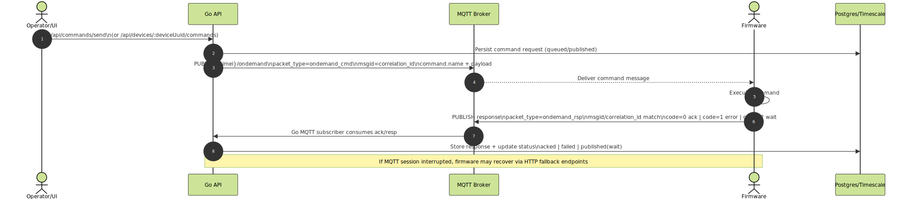
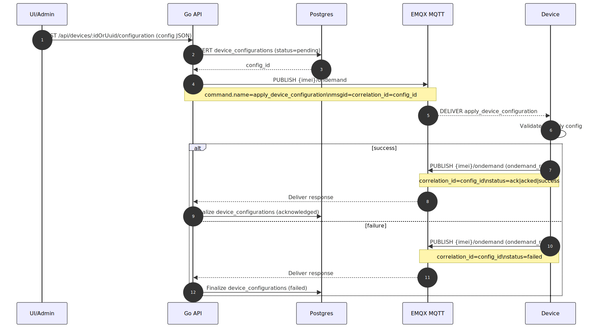

# Sequence Notes: Check-in and Command Roundtrip

## What changed since last refresh (2026-02-18)
- Revalidated check-in prerequisites and command correlation checkpoints.
- Kept forwarded-node sequence aligned with current metadata-route compatibility requirements.
- Preserved failure-handling notes for publish, timeout, and correlation-missing scenarios.
- Added explicit MQTT interruption fallback to open-device command history endpoint.

## A) Device check-in sequence
1. Device performs bootstrap/open call to fetch active credentials and topic settings.
2. Device establishes MQTT session using assigned credentials.
3. Device publishes heartbeat/self telemetry.
4. Server ingests, validates, and records latest state.

Pre-requisites:
- Device must exist and be active.
- Credential lifecycle state must be valid.
- Device ACL must allow publish topic.

## B) Forwarded-node telemetry sequence
1. Gateway receives telemetry from child node (mesh/radio/local protocol).
2. Gateway repackages payload for RMS with route metadata under `metadata.route`.
3. Gateway publishes to the legacy uplink topic (typically `<gateway_imei>/data`).
4. Ingestion persists payload; rules evaluate if schema constraints are satisfied.

Pre-requisites:
- Gateway credential ACL allows canonical publish topic.
- Forwarding metadata keys are allowed in schema when strict checks are enabled.

## C) Command request/response sequence
1. Server publishes command to device command topic.
2. Device executes command.
3. Device publishes ack/resp message with correlation identifier (`correlation_id` or `msgid`).
4. Ingestion correlates and updates command request status.

Failure handling checkpoints:
- If publish fails: request transitions to failed.
- If response missing: remains pending/published until timeout/retry logic handles it.
- If correlation field missing: response may not be linked correctly.
- If device reconnects after a downtime window: fetch recent commands via `/api/device-open/commands/history?imei={imei}&limit={n}` before resuming normal consume loop.

Diagram:

## D) Device configuration apply sequence
Device configuration is delivered using the same command topic and correlation mechanics as other commands, with one additional guarantee:
- Server publishes the configuration command with `msgid=config_id`.
- Device should echo `msgid` in the response (recommended). If supported, also include `correlation_id=config_id`.

Diagram:

