# Firmware Onboarding Quickstart (Legacy-only)

## Goal
bootstrap → connect MQTT → publish telemetry → receive command → ack/resp.

## Base URL modes
- Integration / bring-up:
  - REST: `http://HOST:8081`
  - MQTT (plain): `mqtt://HOST:1884` (only when using integration compose)
- Prod-like:
  - REST: `https://HOST`
  - MQTTS: `mqtts://HOST:8883`

Important:
- `HOST` must be runtime-configurable; firmware must not hardcode one host.
- Use bootstrap response as source of truth for MQTT endpoint.

Diagram:

## Step 1: Bootstrap (required)
- `GET /api/bootstrap?imei=<imei>`
- Header: `x-api-key: <device-api-key>`
- Read and store MQTT endpoint from `primary_broker.endpoints[0]` (or equivalent endpoint object fields).

Diagram:

## Step 2: MQTT connect + subscribe
- Use the returned MQTT credentials.
- Subscribe: `<imei>/ondemand`.

If MQTT connect is rejected (auth/ACL):
1. Retry connect once (short delay).
2. If still rejected, refresh credentials via HTTP:
  - Prefer `GET /api/device-open/credentials/local?imei=<imei>` when available
  - Else call `GET /api/bootstrap?imei=<imei>` again
3. Build broker URL from the refresh response:
  - Prefer `credential.endpoints[0].url`
  - Else use `credential.endpoints[0].protocol + host + port`
  - Else fallback to bootstrap `primary_broker.endpoints[0]`
4. Reconnect using refreshed `username/password/client_id` and re-subscribe `<imei>/ondemand`.

Diagram:

## Step 3: Telemetry publish
Publish to legacy topics:
- `<imei>/heartbeat`
- `<imei>/data` (PumpData payload family)
- `<imei>/daq`

If a publish is rejected (not authorized): treat it as a credentials/ACL issue and follow the same “refresh credentials” steps as MQTT connect rejection.

Diagram:

## Step 4: Forwarded telemetry (gateway mode, optional)
- Publish as gateway identity (topic uses gateway IMEI), and include origin identity in payload metadata.

Diagram:

## Step 5: Commands and responses
- Downlink command on `<imei>/ondemand` (govt legacy shape): `msgid`, `timestamp`, `type=ondemand_cmd`, `cmd`, plus params at top level.
- Uplink response on `<imei>/ondemand`:
  - include `timestamp`, `status` (`ack|wait|failed`)
  - include `code` when used (`0|1|2`)
  - **echo `msgid` from the command** (strong recommendation)

Diagram:

## Recovery (when MQTT continuity is uncertain)
- `GET /api/device-open/commands/status?imei=...`
- `GET /api/device-open/commands/history?imei=...&limit=20`
- `GET /api/device-open/commands/responses?imei=...&limit=20`

Diagram:

## Optional: VFD / RS485 read loop (stub)
If the device controls a VFD over RS485:
1. Fetch VFD model/config:
  - `GET /api/device-open/vfd?imei=<imei>`
2. Use returned RS485 settings (baud/parity/stopbits/slave id) + parameter map.
3. Implement a periodic “read registers → map to telemetry keys → publish” loop.

Diagram:

