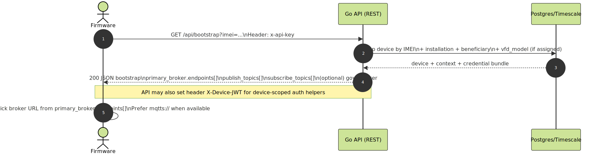
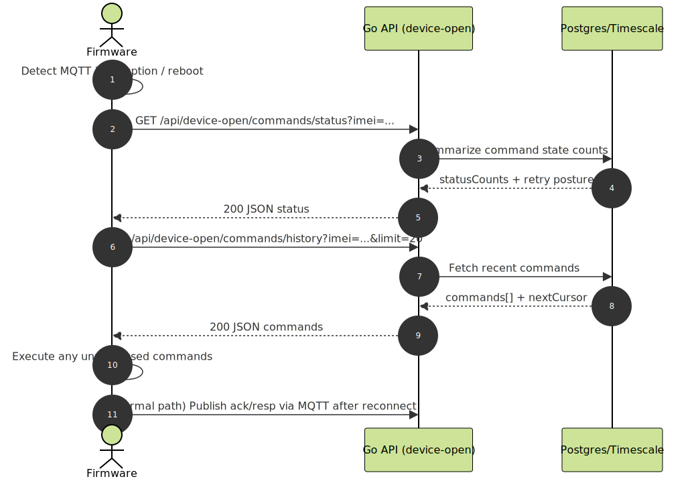
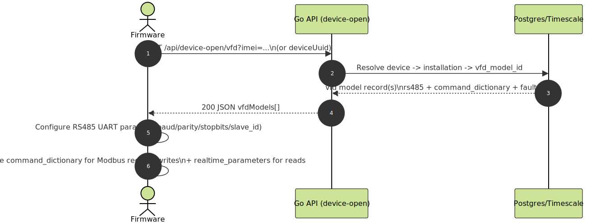

# Firmware Onboarding Quickstart

## Goal
Get a new firmware engineer to a successful end-to-end loop:
1) bootstrap → 2) connect MQTT → 3) publish telemetry → 4) receive command → 5) ack/resp.

## Canonical API prefixes (chosen)
- Device-open family (new firmware/tooling):
  - `/api/device-open/*`
  - `/api/v1/device-open/*`
- Legacy aliases are still supported, but avoid for new firmware:
  - `/api/devices/open/*`
  - `/api/v1/devices/open/*`

## Base URL modes (keep both during bring-up)
### Mode A: Integration / bring-up (HTTP + MQTT)
- REST base: `http://HOST:8081`
- MQTT base: `MQTT HOST:1884` (plain) — only when using `unified-go/docker-compose.integration.yml`

### Mode B: Prod-like (HTTPS + MQTTS)
- REST base: `https://HOST` (Nginx 443)
- MQTT base: `MQTTS HOST:8883` (TLS) — default in `unified-go/docker-compose.yml`

Diagram:

## Step 1: Bootstrap (required)
Canonical endpoint:
- `GET /api/bootstrap?imei=...`
  - Header: `x-api-key: <device-api-key>`
  - Response: includes `primary_broker` and `credentials` (same object for backward compatibility)

Diagram:

Notes:
- `/api/device-open/bootstrap` (and legacy `/api/devices/open/bootstrap`) exist only as aliases and redirect to `/api/bootstrap`.
- Bootstrap may include an optional `govt_broker` block; firmware should treat it as optional.
- Broker endpoint advertisement:
  - Default: derived from `MQTT_PUBLIC_PROTOCOL/HOST/PORT`.
  - Optional multi-endpoint: `MQTT_PUBLIC_URLS` can advertise both secure + insecure endpoints.

## Step 2: MQTT connect + subscribe
- Pick one endpoint from `primary_broker.endpoints`:
  - Prefer secure (`mqtts`) when available.
- Connect using:
  - `username`, `password`, `client_id`
- Recommended session settings (MQTT client):
  - Keep-Alive: set a finite interval (for example 30–120 seconds) so dead links are detected promptly.
  - LWT (Last Will and Testament): optionally publish an "offline" heartbeat-shaped payload to the telemetry uplink topic so operators can see ungraceful disconnects.
    - Topic: `IMEI/heartbeat` (and other supported suffix topics like `/data`, `/daq`, `/errors`)
    - Payload example: `{ "imei": "<imei>", "project_id": "<project_id>", "msgid": "lwt-<uuid>", "packet_type": "heartbeat", "status": "offline", "timestamp": <ms> }`
- Subscribe topics:
  - `primary_broker.subscribe_topics` (typically `IMEI/ondemand`)

Diagram:

## Step 3: Telemetry publish
- Publish to the first `primary_broker.publish_topics` (typically `IMEI/heartbeat`).
- Include envelope fields (at minimum):
  - `imei`, `project_id`, `msgid`, `packet_type`, `timestamp` (or `ts`)

Diagram:

## Step 4: Forwarded telemetry (gateway mode, optional)
If the device is a gateway forwarding child-node data:
- Publish as the gateway identity, but include origin identity under `metadata.origin_node_id` (preferred) or `metadata.origin_imei`.

Optional: fetch forwarding config from server (gateway -> attached nodes list):
- `GET /api/device-open/nodes?imei=...`

Diagram (provisioning + forwarding loop):

Diagram:

## Step 5: Commands and responses
- Device receives command on MQTT command topic.
- Device should publish ack/resp with correlation:
  - Use `correlation_id` if present, else fallback to the command `msgid`.

Command contract (server -> device):
- `packet_type=ondemand_cmd`
- `msgid` == `correlation_id`
- `command.name` + `command.params` (plus legacy `cmd` + `payload`)

Response contract (device -> server):
- `packet_type=ondemand_rsp`
- echo `correlation_id` or `msgid` from command
- Use `code` for deterministic mapping:
  - `0` ack/accepted
  - `1` failed
  - `2` wait (used by `send_immediate` when next periodic publish is ≤30s away)

Diagram:

## Recovery: HTTP command fallback (when MQTT continuity is uncertain)
Use device-open HTTP fallback endpoints:
- `GET /api/device-open/commands/status?imei=...`
- `GET /api/device-open/commands/history?imei=...&limit=20`
- `GET /api/device-open/commands/responses?imei=...&limit=20`

Diagram:

## VFD / RS485 config fetch (if the device controls a VFD)
- `GET /api/device-open/vfd?imei=...` (or `device_uuid`)
- Use returned model metadata:
  - `rs485` params (baud/parity/stop bits/slave id)
  - `realtime_parameters` for read mapping
  - `command_dictionary` for register writes
  - `fault_map` decoding

Diagram:

## What to log on the device (recommended)
Minimum logs that make support/debugging faster:
- Boot timestamp + firmware version
- IMEI, project_id (as used in payload)
- Bootstrap success/failure (HTTP status + retry backoff)
- Selected broker endpoint and whether TLS is enabled
- MQTT connect result codes + reconnect counts
- Publish success/fail counters
- Last `msgid` published and last `correlation_id` executed
- HTTP fallback usage (when/why)

## TLS notes (dev vs prod)
- In dev, you may use insecure TLS (skip verification) while validating end-to-end.
- In prod, devices should validate TLS cert chains and only use MQTTS/HTTPS.
