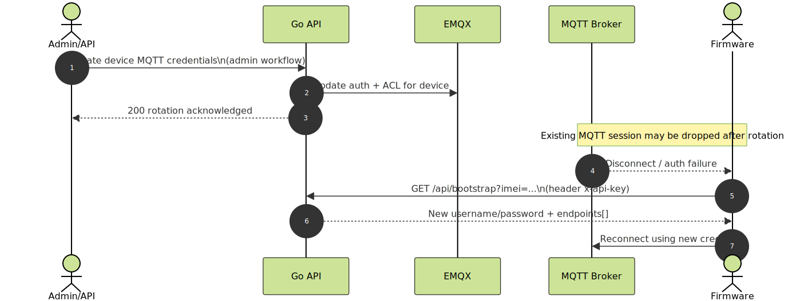
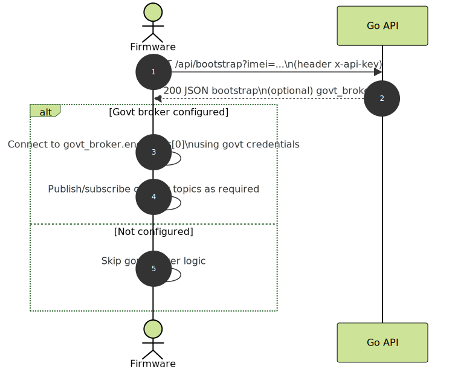

# Firmware Troubleshooting & FAQ

## Canonical references
- Chosen routes: `/api/device-open/*` and `/api/v1/device-open/*`
- Bootstrap (canonical): `/api/bootstrap?imei=...` (requires `x-api-key`)

## Quick triage checklist
1) Can the device bootstrap successfully?
   - If not: confirm IMEI exists, API key is correct, and base URL mode matches environment.
2) Does MQTT connect succeed?
   - If not: validate username/password/client_id from bootstrap and the chosen broker endpoint.
3) Does telemetry publish succeed?
   - If not: check topic ACL + envelope fields + reconnect storm / rate-limits.
4) Are commands being received?
   - If not: confirm subscribe topic and use HTTP fallback.

## Common failure modes

### 1) Bootstrap returns 401 "api key required"
Cause:
- Missing/invalid `x-api-key` header.
Fix:
- Ensure firmware sends `x-api-key` on `GET /api/bootstrap?imei=...`.

### 2) Bootstrap returns 400 "Missing IMEI"
Cause:
- `imei` query param not sent.
Fix:
- Call `GET /api/bootstrap?imei=<imei>`.

### 3) Local credential endpoint returns 404 "device not found"
Cause:
- IMEI unknown to the platform.
Fix:
- Ensure the device is provisioned (admin import/create) and IMEI matches exactly.

### 4) MQTT connect fails: auth error
Likely causes:
- Using old credentials after rotation
- Connecting to wrong port (MQTT vs MQTTS)
- Wrong client_id or username
Fix:
- Re-bootstrap to fetch the latest credentials.
- Prefer secure endpoint when available.

Diagram (rotation → reconnect):

### 5) Commands not received over MQTT
Likely causes:
- Not subscribed to `primary_broker.subscribe_topics`
- Device stuck in reconnect loop
- Broker session drops during rotation
Fix:
- Use HTTP fallback:
  - `/api/device-open/commands/status`
  - `/api/device-open/commands/history`
  - `/api/device-open/commands/responses`

Diagram:

### 6) Forwarded telemetry marked suspicious
Cause:
- Missing origin identity (`metadata.origin_node_id` or `metadata.origin_imei`) or route metadata.
Fix:
- Ensure the forwarded payload includes:
  - `metadata.forwarded=true`
   - `metadata.origin_node_id` (preferred) or `metadata.origin_imei`
  - `metadata.route.path`, `metadata.route.hops`, `metadata.route.ingress`

Diagram:

### 7) VFD/RS485 settings missing
Cause:
- No installation row or no `vfd_model_id` assigned.
Fix:
- Confirm installation + VFD model assignment exists for the device.

Diagram:

## FAQ

### Q: Should firmware use `/api/v1/...` routes?
A: Only if you intentionally want to pin to the versioned alias. For new firmware, use `/api/device-open/*` unless a release plan says otherwise.

### Q: Why does bootstrap require API key, but device-open endpoints look public?
A: Bootstrap is intentionally guarded (`x-api-key`) to avoid leaking broker credentials. Device-open endpoints exist for compatibility and operational tooling; deploy behind HTTPS and rate-limit at the edge.

### Q: Can the server advertise both secure and insecure broker URLs?
A: Yes. Configure `MQTT_PUBLIC_URLS` to return multiple `endpoints[]` during phased bring-up.

### Q: Do we need to implement govt broker logic?
A: Only if `govt_broker` is present in bootstrap or your project requires it.

Diagram:

