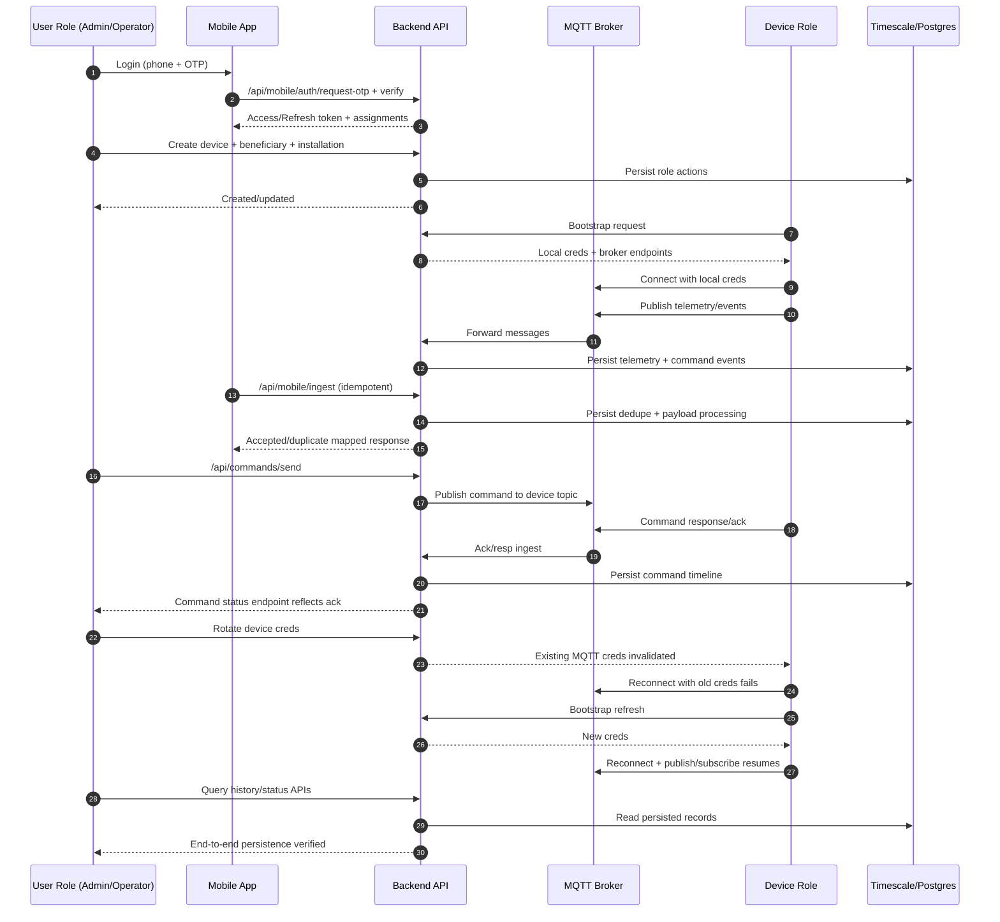

# Internal Test Automation and Sequence Plan

Date: 2026-03-04

## Goal

Establish an internal long automated flow that covers:
- mobile auth bootstrap
- user-role API actions
- device-role bootstrap + MQTT pub/sub
- persistence checks
- credential rotation and reconnect validation

## Automation entrypoints

- Script: `app-kusumc/scripts/long-automated-mobile-auth-to-persistence.ps1`
- ADB smoke helper: `app-kusumc/scripts/mobile-adb-smoke.ps1`
- ADB OTP injector helper: `app-kusumc/scripts/mobile-adb-inject-server-otp.ps1`
- ADB UI auditor helper: `app-kusumc/scripts/mobile-ui-auditor.ps1`

## OTP injection for internal login (no external OTP service)

Use this flow when OTP is generated on backend and must be entered on-device via ADB:

1. Open login screen on device and keep OTP field ready.
2. Run helper (auth-guarded path example):
    - `./scripts/mobile-adb-inject-server-otp.ps1 -Phone 9999999999 -ApiBase https://rms-iot.local:7443/api/mobile -AuthBase https://rms-iot.local:7443/api -AuthUsername Him -AuthPassword 0554 -RequestOtpFromServer -PressEnterAfterInject`
3. Script fetches latest active server OTP and injects it via `adb shell input text`.

For pure app-requested OTP flow, omit `-RequestOtpFromServer` and run helper immediately after tapping request OTP in app.

## Long-run sequential checklist

1. Bring up backend stack from latest source.
2. Execute user-role + device-role E2E (`TestRMSMegaFlow`, `TestDeviceCommandLifecycle`, `TestKusumFullCycle`).
3. Execute mobile bridge E2E (`TestMobileIngest_IdempotencyReplay`, `TestMobileCommandStatus_Mapping`).
4. Build Android debug + androidTest sources + focused unit tests.
5. Optionally install debug APK over ADB.
6. Optionally launch app and collect focused logs over ADB.
7. Run authenticated UI auditor flow (drawer navigation + on-demand command + simulation toggle + backend command API assertion).
7. Review pass/fail and persist artifacts.

## Authenticated UI auditor (ADB)

Use this helper after OTP login (or run it via long-run script with `-RunAdbUiAudit`):

- `./scripts/mobile-ui-auditor.ps1 -LaunchApp -NavigateDrawer -RunOnDemandCommand -RunSimulationToggle -VerifyBackendCommandApi -AuthBase https://rms-iot.local:7443/api -AuthUsername Him -AuthPassword 0554 -CommandQueryBase https://rms-iot.local:7443/api -ProjectId pm-kusum-solar-pump-msedcl -DeviceId 869630050762180`

This validates:
- authenticated app state (not stuck on login)
- bypass-login action (`Login with Him / 0554`) when login screen is visible, with OTP injector fallback if bypass button is unavailable
- drawer route navigation (`Home`, `Dashboard`, `Settings`)
- dashboard on-demand command interaction (`Turn ON`)
- settings simulation run (`Simulate Data` -> `Stop Data Simulation`)
- backend command timeline API visibility after command action

## Sequence diagram (User Role → Backend → Broker → Device Role → User Role)

